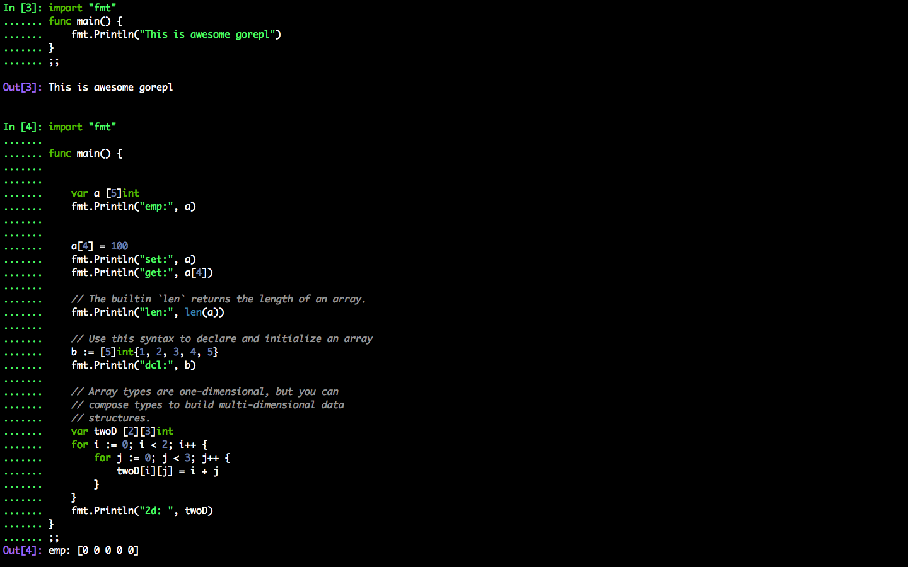
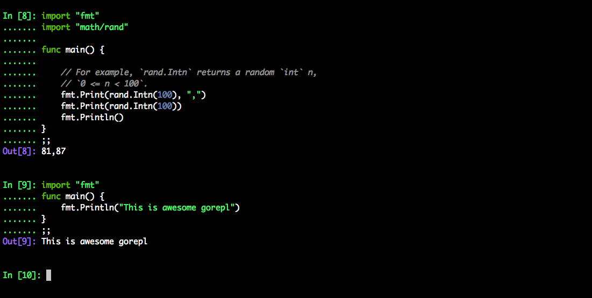

AA REPL for GOlang
-------------------
|CodeCov| 

This is a GORepl inspired by IPYTHON with auto-completion and syntax highlighting.
Feel free to contribute. Thank you!!

.. |CodeCov| image:: https://codecov.io/gh/dbcli/pgcli/branch/master/graph/badge.svg
   :target: https://codecov.io/gh/dbcli/pgcli
   :alt: Code coverage report

.. |Landscape| image:: https://landscape.io/github/dbcli/pgcli/master/landscape.svg?style=flat
   :target: https://landscape.io/github/dbcli/pgcli/master
   :alt: Code Health

.. |PyPI| image:: https://img.shields.io/pypi/v/pgcli.svg
    :target: https://pypi.python.org/pypi/pgcli/
    :alt: Latest Version

